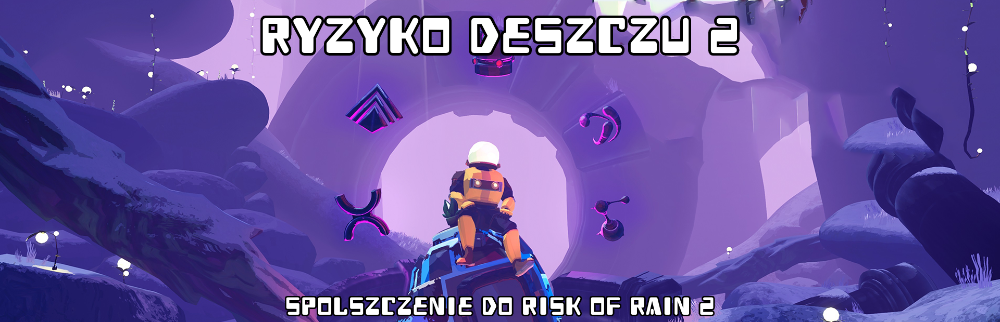

 

<p align="center">
  <a href="https://store.steampowered.com/app/632360/Risk_of_Rain_2/">
    
  </a>

Wersja v0.6 (Itemy #2) aktualny postęp: 
Ostatnia zmiana w pliku:

### Chcesz pomóc?:
[Dołącz do tłumaczenia na gitlocalize](https://gitlocalize.com/repo/9490/).

### Kontakt
* Discord: @allegrojacc
* Email: allegrojacc@gmail.com


### Celem tego projektu jest stworzenie pełnego spolszczenia gry Risk of Rain 2. Obejmuje to tłumaczenie na język polski:

* Tekstów interfejsu użytkownika
* Opisów przedmiotów
* Umiejętności postaci
* Wrogów
* Opisów poziomów
* Dialogów

### Postęp prac:

* Mechaniczne Tłumaczenie gry jest gotowa w  ✅
* Poprawka Mechanicznego Tłumaczenia jest gotowa w 
* Korekta jest gotowa w 


### Wersja STEAM:


* Pobierz plik .exe spolszczenia z zakladki Releases. Instalator sam wykryje lokalizacje foldera gry STEAM


 ### Manualna instalacja STEAM/Epic


```
Pobierz folder PL z repo i przenieś go do:

Risk of Rain 2\Risk of Rain 2_Data\StreamingAssets\Language
```
    